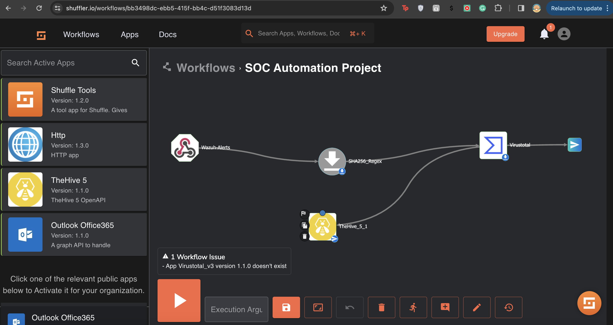

# Open Source Security Operations Center (SOC) | Wazuh | The Hive | Shuffle | Virus Total

### Summary
- The project involves creating a Security Operations Center (SOC) Automation system in a home lab environment.
- The aim is to set up a fully functional Wazuh instance with SOAR integration and implement case management using The Hive.
- The project consists of five labs, focusing on hands-on experience for day-to-day security operations

>FINAL RESULTS: SOC architecture and the data flow within resources which is able to detect and alert the SOC analyst through email

### Technologies:
* Microsft Azure - a cloud computing service operated by Microsoft for application management via Microsoft-managed data centres
* Services within Azure: Virtual Machines for Wazuh instance and The Hive
* Shuffle 
* Virus Total
* Mimikatz

## Lab 1:
### Step 1: Lab Planning
- First, we will be creating a logical diagram to plan and map out the lab setup.
- The emphasis is on building a visual representation to understand the flow of data and identify the components necessary for the system to function.
- I recommend using draw.io for creating the diagram due to its accessibility and free usage.

### Step 2: Diagram Creation Steps
- The diagram includes components such as a Windows 10 client, router, internet (cloud), Wasuh manager, The Hive, Shuffle, and a SOC analyst workstation.
- Logical connections are established using arrows to represent the flow of events and actions between these components.
- Different arrow colours and types are used to signify various actions, such as sending events, receiving events, sending alerts, enriching IOCs (Indicators of Compromise), sending emails, and responding to actions.

### Step 3: Workflow Overview
- The logical workflow involves the Windows 10 client sending events to Wazuh manager, triggering alerts or responsive actions.
- Wazuh manager sends alerts to Shuffle, which then performs actions like enriching IOCs, sending alerts to The Hive, and sending emails to the SOC analyst.
- The SOC analyst may respond to alerts, initiating actions that are communicated back through the system to ultimately instruct the Windows 10 client.

### Step 4: Lab Progression

- The diagram serves as a reference for the subsequent parts of the series, where the focus will shift to the installation of virtual machines.
- The goal is to build a functional SOC Automation system with three hosts, including one PC and two servers (The Hive and Wazah) residing in the cloud.

 

## Lab 2:
> Lab 2 aims to install applications and virtual machines, targeting one Windows 10 machine with Sysmon, one Wazuh server, and one Hive server.
> Virtual machines for Wazuh and Hive will be set up in the cloud, while the Windows 10 client will be hosted locally on a server.

### Step 1: Wazuh Overview
- Wazuh is described as an open-source cybersecurity platform integrating SIEM and XDR capabilities, providing features like security analytics, intrusion detection, and incident response.
- The three main components of Wazuh are the indexer, server, and dashboard.

### Step 2: Virtual Machine setup

- Windows 10 and Ubuntu 20.04 are chosen as the client and server operating systems, respectively.
- Azure VMs are selected as the virtualization tool for installation. The process includes creating a vm on Azure portal

> Spin up a Windows VM and RDP into it for next steps

### Step 3: Sysmon Installation

- Sysmon, a system monitoring tool for Windows, is installed on the Windows 10 client to capture telemetry data and enhance security monitoring.
- The process involves downloading the Windows ISO, setting up a virtual machine in Virtual Box, and then installing and configuring Sysmon on the Windows client machine.

> Sysmon64 started in our VM

> Verifying that Sysmon is successfully installed by checking it under Event Viewer for Windows

### Step 4: Wazuh Installation on VM

  
## Lab 3:
> The objective of this lab is to configure Hive and Wazuh servers in the SOC Automation Project Home Lab.

### Step 1: Hive Configuration

- Cassandra configuration files are edited to customize listen_address, RPC address, and seed address.
  
  
  
  
- Cassandra service is stopped, old files are removed, and the service is started again.
  
  
- Elasticsearch configuration files are edited, and the service is started and enabled.
  
- Ownership of certain directories is changed to allow the Hive user access.
  
- The Hive configuration file is edited to set database and index configurations.
  

### Step 2: Hive Verification

- Hive services are started and enabled, and their status is verified to be active and running.
- The Hive dashboard is accessed via the public IP and Port 9000.

  
  > Confirming that all 3 services are in active(running) state

>Elasticsearch Troubleshooting: In case of login errors, Elasticsearch memory allocation is adjusted using a custom JVM option file.

### Step 3: Wazuh Configuration

- Administrative credentials are used to log into the Wazuh dashboard.
- An agent is added for a Windows machine using its public IP, and the agent is installed using a provided command.
- The Waszuh service is started, and the agent's status is verified on the dashboard.
> Note: The overall goal is to detect Mimikatz usage on the Windows 10 client machine, and Telemetry generation and alert creation for Mimikatz will be covered in the next episode.

 

## Lab 4:
> The objective of this lab is to generate telemetry from a Windows 10 machine and ensure its ingestion into Wazuh. The ultimate goal is to properly configure and send telemetry containing Mimikatz data, triggering a custom alert in Wasa.

### Step 1: Configuration of Wazuh:

- The configuration file for Wasa, named ossec.conf, is located under Program Files x86 in the Filebeat agent directory.
- The file is opened with Notepad, and log analysis settings are modified, including exclusion of certain event IDs for security reasons.
- Configuration is adjusted to ingest Sysmon logs, and steps include obtaining the Sysmon channel name from the Windows Event Viewer.

  
  
  

### Step 2: Mimikatz Setup:

- Windows Defender is disabled or the Downloads folder is excluded to prevent interference while downloading Mimikatz.
- Mimikatz is downloaded and extracted, and an administrative PowerShell session is used to run Mimikatz.
- Events related to Mimikatz are checked in the Wasa dashboard to ensure successful ingestion.

### Step 3: Logging Configuration and Rule Creation:

- Configuration changes are made to log all events in Wasa by modifying the osc.com file.
- The Wazuh manager service is restarted to initiate logging, and Filebeat settings are adjusted for archiving.
- An index is created for searching logs, and the process of creating a custom rule in Wasa for Mimikatz detection is detailed.

### Step 4: Testing and Verification:

- The Mimikatz test is performed, and the video demonstrates how to check for Mimikatz events in the Wasa dashboard.
- Custom rules are created to detect Mimikatz activities, and the final part of the video emphasizes the importance of research and encourages viewers to stay curious and think differently.

## Lab 5

>In the final part of a series on the SOC (Security Operations Center) Automation Project, focusing on connecting the SOAR (Security Orchestration, Automation, and Response) platform Shuffle with The Hive and Wasa.

The presenter recommends watching the previous parts of the series to understand the process of building the lab, installing, configuring, and generating telemetry.

The objective of the video is to create a fully functional lab that integrates Wasa, The Hive, and Shuffle. The presenter introduces a new tool and provides an additional lab for practice.

The video covers the process of creating a workflow in Shuffle, including selecting triggers, naming web hooks, and configuring executions. Troubleshooting steps are discussed, including modifying configuration files and utilizing VirusTotal's API.

The integration involves connecting Shuffle with Wasa, creating an organization and user in The Hive, and setting up an active response in Wasa to block a specified IP address based on analyst input. The presenter emphasizes the limitless possibilities for automation in a SOC environment.

